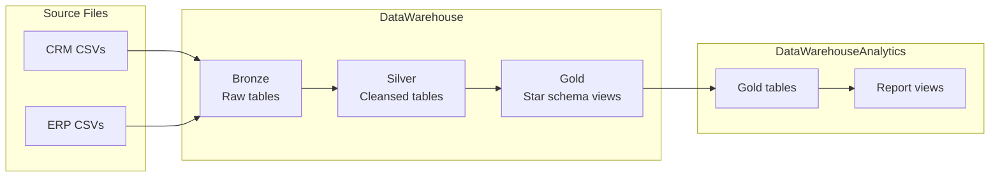

# SQL Data Warehouse Project

An end-to-end **SQL Server** data warehouse built with the **medallion architecture** (Bronze → Silver → Gold). Source data from CRM and ERP systems is ingested from CSV files, cleansed and conformed in the Silver layer, and modeled as a star schema in Gold for reporting and exploratory analytics.

## Overview

| Database | Purpose |
|----------|---------|
| **DataWarehouse** | Main warehouse with `bronze`, `silver`, and `gold` schemas |
| **DataWarehouseAnalytics** | Physical Gold tables plus report views for BI-style analysis |

**Source systems**

- **CRM** — customers, products, sales transactions (`datasets/source_crm/`)
- **ERP** — customer attributes, locations, product categories (`datasets/source_erp/`)

## Architecture



### Gold layer (star schema)

| Object | Type | Description |
|--------|------|-------------|
| `gold.dim_customers` | Dimension | Customer attributes (CRM + ERP) |
| `gold.dim_products` | Dimension | Product and category attributes |
| `gold.fact_sales` | Fact | Sales orders linked to customer and product keys |
| `gold.report_customers` | Report view | Customer KPIs, segments, recency |
| `gold.report_products` | Report view | Product KPIs, performance segments |

## Prerequisites

- **Microsoft SQL Server** (Developer or Express edition is fine)
- **SQL Server Management Studio (SSMS)** or **Azure Data Studio** to run scripts
- Permission to run `BULK INSERT` (typically requires membership in the **bulkadmin** server role, or loading via a method your DBA approves)
- Clone this repo to a local path and update CSV paths in the Bronze load procedure if your folder is not `D:\sql-dwh-project`

## Project structure

```
sql-dwh-project/
├── datasets/
│   ├── source_crm/          # CRM CSV exports
│   └── source_erp/          # ERP CSV exports
├── scripts/
│   ├── init_database.sql    # Create DataWarehouse + Gold views
│   ├── bronze/
│   │   ├── ddl_bronze.sql
│   │   └── proc_load_bronze.sql
│   ├── silver/
│   │   ├── ddl_silver.sql
│   │   └── proc_load_silver.sql
│   └── gold/
│       └── ddl_gold.sql     # Optional; views also created in init_database.sql
├── tests/
│   ├── quality_checks_silver.sql
│   └── quality_checks_gold.sql
├── analysis/
│   ├── 00_init_database.sql # Create DataWarehouseAnalytics
│   └── 01–13_*.sql          # Exploration and reporting queries
└── analysis_results/        # Chart outputs from analysis scripts
```

## Setup and execution

Run scripts **in order** in SSMS or Azure Data Studio. Each init script **drops and recreates** its database—use only in development.

### Phase 1 — Build the warehouse (`DataWarehouse`)

| Step | Script / command |
|------|------------------|
| 1 | `scripts/init_database.sql` |
| 2 | `scripts/bronze/ddl_bronze.sql` |
| 3 | `EXEC bronze.load_bronze` *(from `proc_load_bronze.sql`)* |
| 4 | `scripts/silver/ddl_silver.sql` |
| 5 | `EXEC silver.load_silver` *(from `proc_load_silver.sql`)* |
| 6 | `scripts/gold/ddl_gold.sql` *(optional if views already exist from step 1)* |

**Configure CSV paths:** `scripts/bronze/proc_load_bronze.sql` uses absolute paths such as `D:\sql-dwh-project\datasets\...`. After cloning elsewhere, search for `D:\sql-dwh-project` and replace with your local repo path.

### Phase 2 — Quality checks

| Layer | Script |
|-------|--------|
| Silver | `tests/quality_checks_silver.sql` |
| Gold | `tests/quality_checks_gold.sql` |

Investigate any rows returned by these scripts before proceeding.

### Phase 3 — Analytics database (`DataWarehouseAnalytics`)

| Step | Script |
|------|--------|
| 1 | `analysis/00_init_database.sql` — materializes Gold tables and report views |

Requires `DataWarehouse` to be fully loaded first.

### Phase 4 — Exploratory analysis

Run scripts in `analysis/` against `DataWarehouseAnalytics` (use database context `USE DataWarehouseAnalytics` where needed):

| Script | Focus |
|--------|--------|
| `01_database_exploration.sql` | Schema and table metadata |
| `02_dimensions_exploration.sql` | Countries, categories, products |
| `03_date_range_exploration.sql` | Order dates, customer age range |
| `04_measures_exploration.sql` | Core business metrics |
| `05_magnitude_analysis.sql` | Aggregations by country, gender, category |
| `06_ranking_analysis.sql` | Top-N style rankings |
| `07_change_over_time_analysis.sql` | Trends over time |
| `08_cumulative_analysis.sql` | Running totals |
| `09_performance_analysis.sql` | Performance metrics |
| `10_data_segmentation.sql` | Customer/product segments |
| `11_part_to_whole_analysis.sql` | Composition / share analysis |
| `12_report_customers.sql` | Customer report deep-dive |
| `13_report_products.sql` | Product report deep-dive |

Sample chart outputs are saved under `analysis_results/`.

## Data flow summary

1. **Bronze** — Raw CSV data loaded via `BULK INSERT` into staging tables.
2. **Silver** — Cleansing, standardization, and business rules applied from Bronze.
3. **Gold** — Dimensional model (star schema) exposed as views in `DataWarehouse`.
4. **Analytics** — Gold views copied into physical tables in `DataWarehouseAnalytics` for faster querying and downstream reports.

## Troubleshooting

| Issue | Suggestion |
|-------|------------|
| `BULK INSERT` permission denied | Add your login to the **bulkadmin** role or ask your DBA for an approved load path |
| File not found during Bronze load | Update paths in `proc_load_bronze.sql` to match your clone location |
| `DataWarehouseAnalytics` init fails | Confirm all Phase 1 steps completed and Gold views return data |
| Git SSL errors on Windows | Use Windows certificate store: `git config --global http.sslBackend schannel` |

## License

See repository history for license information. A `LICENSE` file may be added separately.

## Repository

[https://github.com/Mennah-Elsheikh/sql-dwh-project](https://github.com/Mennah-Elsheikh/sql-dwh-project)
